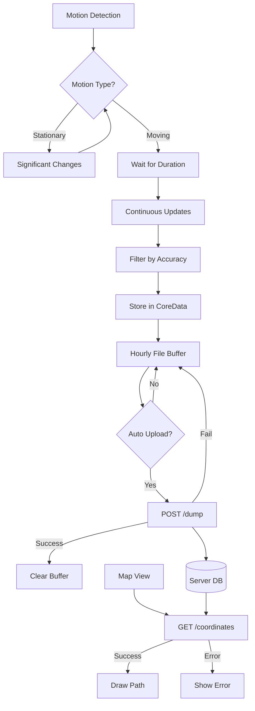

# Trace

iOS location tracking app optimized for battery life and privacy. Uses CoreMotion for activity detection and CoreLocation for high-accuracy GPS data collection during non-stationary periods. Inspired by and compatible with [Overland](https://github.com/aaronpk/Overland-iOS), but redesigned for sustained high-resolution tracking through power management.

## Core Features

- 📍 **Motion-Based Tracking**
    - Active during: walking, running, cycling, driving
    - Inactive during: stationary periods - saves battery by not querying GPS
    - Configurable accuracy threshold
    - Configurable motion duration to prevent brief tracking
    - Significant location setting changes when stationary
    - Silent background audio for reliable constant operation in background
    - GeoJSON output files are compatible with [Overland](https://github.com/aaronpk/Overland-iOS/)

- 🗺️ **Map Visualization**
    - MapKit integration with path overlay
    - Historical data with configurable lookback

- 📊 **Stats & Monitoring**
    - Location: coordinates ± accuracy (m)
    - Motion type
    - Metrics: speed, altitude, buffer size


## Data Flow


## Settings
- **Required Motion Duration**: Time in seconds of sustained motion before starting GPS tracking (0s for immediate).
- **Minimum Accuracy**: Maximum allowed GPS accuracy radius in meters for storing points.
- **History Lookback**: Number of days of data to display on the map.
- **Minimum Path Length**: Minimum number of points required to display a path segment on the map.

## Implementation Details
- Uses CoreMotion for activity detection (walking, running, cycling, automotive)
- CoreLocation for GPS with configurable accuracy
- Silent audio playback to maintain background operation
- CoreData for local storage
- URLSession for API communication

## Development Requirements
- iOS 18.0+

- Required capabilities:
  - Background Location
  - Background Audio
  - Background Fetch

## Key Files
- `LocationManager`: Handles motion detection and location updates
- `ServerAPIManager`: Manages data storage and upload
- `AudioManager`: Maintains background operation
- `ContentView`: Main UI with map and stats
- `SettingsView`: Configuration interface

## Export Data Format
Compatible with Overland's GeoJSON format:
```json
{
    "type": "Feature",
    "geometry": {
        "type": "Point",
        "coordinates": [13.361912, 52.541819]
    },
    "properties": {
        "speed": 5,
        "battery_state": "unplugged",
        "motion": ["walking"],
        "timestamp": "2021-11-01T18:06:37Z",
        "battery_level": 0.89,
        "vertical_accuracy": 16,
        "horizontal_accuracy": 35,
        "wifi": "network-name",
        "activity": "other",
        "altitude": 39
    }
}
```

## Server Requirements

Data dumping and in-app map visualization requires an HTTP API with the following endpoints.

[Example minimal server code can be found here](https://github.com/momonala/incognita/blob/master/incognita/overland_server.py)

### API Endpoints

#### Health Check
```http
GET /status
Response: {"status": "ok"}
```

#### Upload Location Data
```http
POST /dump
Body: GeoJSON Feature Collection
Response: {"result": "ok"}
```

#### Fetch Location History
```http
GET /coordinates?lookback_hours=24
Response: {
    "status": "success",
    "count": <int>,
    "lookback_hours": <int>,
    "coordinates": [
        [timestamp, latitude, longitude],
        ...
    ]
}
```

### Server Implementation
The server:
- Stores raw GeoJSON files with timestamps
- Updates SQLite database for querying
- Provides configurable history lookback
- Implements basic error handling
