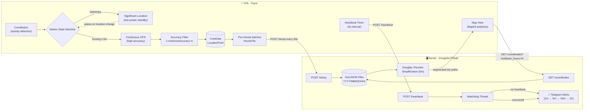

# Trace

Trace is an iOS app for continuous GPS tracking, designed to run indefinitely in the background without killing the battery. It uses CoreMotion to detect movement and only activates full GPS when motion is sustained — skipping GPS entirely during stationary periods. In practice, this cuts battery usage roughly in half compared to constant GPS at the same resolution. Location data is stored locally in CoreData and uploaded in batches to a private server in Overland-compatible GeoJSON format.

Inspired by [Overland](https://github.com/aaronpk/Overland-iOS), but rebuilt from scratch to prioritize long-duration, high-resolution tracking.

---

## How It Works

### Motion-Gated Tracking

The app doesn't run GPS continuously. CoreMotion monitors device activity at all times using its low-power activity API. When sustained motion is detected (walking, running, cycling, or driving), the app switches from low-power significant-location monitoring to continuous high-accuracy GPS. When stationary again for a configurable duration, it drops back down. This avoids burning GPS on false positives like picking up your phone briefly.

### Background Operation

iOS suspends background apps aggressively. To keep the tracking pipeline alive, Trace plays a silent audio stream (volume 0, 440Hz sine wave) via `AVAudioSession`'s `.playback` category, which holds an audio background mode entitlement. This is a well-known technique in location tracking apps not distributed through the App Store. The audio session pauses when the app is foregrounded to avoid unnecessary drain.

### Data Pipeline

GPS points are written to CoreData locally and grouped into per-minute `HourlyFile` batches. Every 60 seconds (when auto-upload is enabled), completed batches are sent to the server's `/dump` endpoint as GeoJSON. On success, the local point data is cleared. Failed uploads are retried on the next cycle.

The map view pulls historical paths from the server's `/coordinates` endpoint and renders them as polylines. Lookback range is configurable.

### Live Activity

A Lock Screen and Dynamic Island widget shows tracking status, the last GPS fix time, and the last server heartbeat — updated on each location fix. It's implemented as a separate extension target using ActivityKit.

---

## Settings

| Setting | What it does |
|---|---|
| **Required Motion Duration** | Seconds of sustained motion before GPS activates. Set to 0 for immediate start. Higher values reduce false positives at the cost of missing the first few seconds of a trip. |
| **Minimum Accuracy** | Maximum allowed horizontal accuracy radius in meters. Points outside this threshold are discarded. Tighten in open areas; loosen in dense urban environments where 50m is often the best available. |
| **History Lookback** | Days of historical data to fetch and display on the map. |
| **Auto-Upload** | Enables the 60-second upload timer. Disable to accumulate data locally and upload manually. |

---

## Architecture

The app is built around two singleton service classes, both using Swift's `@Observable` macro and running on `@MainActor`:

- **`LocationManager`** — Owns the CoreMotion and CoreLocation pipelines. Manages the motion state machine, filters points by accuracy, writes `LocationPoint` records to CoreData on a background context, and manages the Live Activity lifecycle.
- **`ServerAPIManager`** — Owns the upload queue. Creates per-minute `HourlyFile` batches, manages the auto-upload timer, and sends heartbeats to the server.
- **`AudioManager`** — Generates and loops a silent WAV file to hold the audio background mode.

Settings (`minimumAccuracy`, `lookbackDays`, `requiredMotionSeconds`) are persisted to `UserDefaults` via `didSet` and restored on launch.

### Key Files

| File | Role |
|---|---|
| `LocationManager.swift` | Motion detection, GPS pipeline, Live Activity, map data refresh |
| `ServerAPIManager.swift` | Upload queue, per-minute file batching, heartbeat |
| `AudioManager.swift` | Silent background audio keep-alive |
| `Persistence.swift` | CoreData stack (`LocationPoint`, `HourlyFile`) |
| `ContentView.swift` | Map view (MapKit + polyline rendering) and stats overlay |
| `SettingsView.swift` | Configuration UI |
| `TraceActivityAttributes.swift` | Live Activity data model |
| `TraceWidgetsLiveActivity.swift` | Lock Screen and Dynamic Island widget UI |

---

## Data Flow


```mermaid
graph LR
    subgraph ios["📱 iOS - Trace"]
        CM["CoreMotion\n(activity detection)"]
        SM{Motion State Machine}
        SLC["Significant Location\n(low-power standby)"]
        GPS["Continuous GPS\n(high-accuracy)"]
        FILT["Accuracy Filter\n≤ minimumAccuracy m"]
        CD[("CoreData\nLocationPoint")]
        BATCH["Per-minute batches\nHourlyFile"]
        HBT["Heartbeat Timer\n(3s interval)"]
        MV["Map View\n(MapKit polylines)"]

        CM --> SM
        SM -- stationary --> SLC
        SM -- "moving ≥ Ns" --> GPS
        SLC -. "wakes on location change" .-> SM
        GPS --> FILT
        FILT --> CD
        CD --> BATCH
    end

    subgraph server["🖥️ Server - Incognita (Flask)"]
        DUMP["POST /dump"]
        HBE["POST /heartbeat"]
        COORD["GET /coordinates"]
        FS[("GeoJSON Files\nYYYY/MM/DD/HH/")]
        DP["Douglas–Peucker\nSimplification (5m)"]
        WD["Watchdog Thread"]
        TG["📨 Telegram Alerts\n(1m → 5m → 10m → 1h)"]

        DUMP --> FS
        HBE --> WD
        WD -- "no heartbeat" --> TG
        WD -- "recovered" --> TG
        COORD --> FS
        FS --> DP
    end

    BATCH -- "POST /dump every 60s" --> DUMP
    HBT -- "POST /heartbeat" --> HBE
    MV -- "GET /coordinates?lookback_hours=N" --> COORD
    DP -- "segmented trip paths" --> MV
```

---

## Data Format

Uploads use Overland's GeoJSON feature format:

```json
{
    "type": "Feature",
    "geometry": {
        "type": "Point",
        "coordinates": [13.361912, 52.541819]
    },
    "properties": {
        "speed": 5,
        "motion": ["walking"],
        "timestamp": "2021-11-01T18:06:37Z",
        "altitude": 39,
        "horizontal_accuracy": 35,
        "vertical_accuracy": 16
    }
}
```

---

## Server — Incognita

The companion server is a Flask app in [`incognita/`](incognita/). It receives uploads and writes raw GeoJSON to disk in a date-partitioned directory structure (`YYYY/MM/DD/HH/`). Filenames are derived from a content hash of the first timestamp, last timestamp, and point count — so duplicate uploads from retried batches are silently skipped.

A background watchdog thread monitors the heartbeat endpoint. If no heartbeat arrives within 60 seconds, it sends a Telegram alert and escalates at 5m, 10m, and 1h intervals until the connection recovers. Alerts are suppressed between 11pm and 7am.

### Endpoints

#### Health check
```http
GET /status
→ {"status": "ok"}
```

#### Upload location data
```http
POST /dump
Content-Type: application/json
Body: {"locations": [<GeoJSON Feature>, ...]}
→ {"result": "ok"}
```

Writes a `.geojson` file to `incognita_raw_data/YYYY/MM/DD/HH/` and updates SQLite. Duplicate payloads (same content hash) are skipped.

#### Fetch location history
```http
GET /coordinates?lookback_hours=24
→ {
    "status": "success",
    "count": 412,
    "lookback_hours": 24,
    "paths": [
        [{"timestamp": "...", "latitude": 52.54, "longitude": 13.36}, ...]
    ]
}
```

Reads directly from the raw GeoJSON files. Before returning, paths are segmented (splits on gaps >60s or >100m between points) and simplified using Douglas-Peucker at a 5m tolerance, which typically reduces point count significantly. Each segment is returned as a separate array so the app can render discrete polylines without drawing straight lines across coverage gaps.

#### Heartbeat
```http
POST /heartbeat
→ {"status": "ok"}
```

Resets the watchdog timer. Alerts fire via Telegram if this goes missing for more than 60 seconds.

---

## Requirements

- iOS 18.0+
- Xcode 16+
- Required entitlements: Background Location, Background Audio
- A self-hosted server implementing the API above
